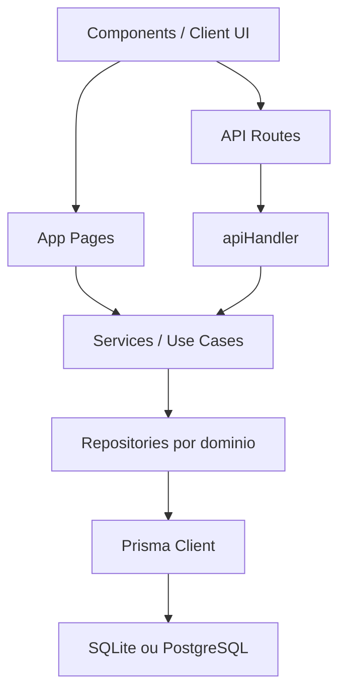

# Architecture

Este documento descreve a arquitetura atual do FluxoCasa depois das ultimas rodadas de estabilizacao.

## Visao Geral

O projeto usa App Router do Next.js com separacao clara entre UI, pagina, API, services, repositories e persistencia Prisma.

## Camadas

### UI e paginas

- `src/app`
- `src/components`

Responsabilidades:

- renderizacao server-side das telas
- interacao do usuario
- formularios cliente
- navegacao principal
- leitura de snapshots para montagem das telas

### API layer

- `src/app/api`
- `src/server/http/handler.ts`

Responsabilidades:

- autenticar requisicoes
- validar payloads com `zod`
- padronizar respostas
- centralizar tratamento de erro e logging

### Services

- `src/server/services`

Responsabilidades:

- expor casos de uso para paginas e APIs
- manter a camada de entrada fina
- encapsular a orquestracao entre domnios

Services atuais com papel mais forte:

- `calendar.service.ts`
- `metas.service.ts`
- `notes.service.ts`

### Repositories

- `src/server/repositories`

Responsabilidades:

- concentrar regras de dominio e acesso a dados
- montar snapshots usados nas telas
- padronizar contratos entre banco e UI

Repositorios principais:

- `personal.repository.ts`
- `house.repository.ts`
- `dashboard.repository.ts`
- `residents.repository.ts`
- `_shared.ts`
- `_recurrence.ts`

### Realtime e sincronizacao

O produto usa duas estrategias de sincronizacao:

- revalidacao granular server-side para mudancas de dominio
- realtime seguro para `Anotacoes`

No mural de anotacoes:

- a UI escuta mudancas da tabela `Nota` via Supabase Realtime
- o acesso ao canal depende de RLS aplicado diretamente no banco
- quando o cliente realtime nao esta disponivel, a tela faz sincronizacao periodica e ao voltar foco

### Persistencia

- Prisma
- `prisma/schema.prisma`

Banco atual:

- producao: PostgreSQL / Supabase
- fallback local: SQLite

## Autenticacao

O produto usa login com Google via Supabase Auth.

- callback em `/auth/callback`
- sincronizacao do usuario autenticado para `Morador`
- associacao por e-mail somente depois de e-mail verificado no provedor

Para a suite E2E local, os testes criam um cookie assinado diretamente no contexto do navegador. Esse mecanismo nao fica exposto por rotas publicas da aplicacao.

## Fluxo de escrita

Toda mutacao relevante segue este pipeline:

1. componente cliente chama rota ou action
2. rota passa pelo `apiHandler`
3. `apiHandler` autentica e valida
4. service chama repository
5. repository persiste no Prisma
6. `revalidateAppViews()` invalida apenas as views necessarias
7. UI executa refresh leve da tela atual

## Dominios atuais

### Casa

- criacao e entrada por convite
- codigo de convite rotativo
- contribuicoes mensais
- contas da casa
- saida da casa
- remocao de morador
- troca de admin
- auditoria da casa
- saude financeira compartilhada

### Pessoal

- rendas
- contas pessoais
- gastos
- metas
- anotacoes pessoais privadas e publicas
- recebimento previsto x recebido
- recorrencia
- status de urgencia

### Anotacoes

- mural unico em `/anotacoes`
- visibilidade `privada`, `pessoal publica` e `da casa`
- CRUD via API protegida
- reorder por `posicao`
- drag-and-drop no desktop e fallback por botoes no mobile

### Dashboard e analytics

- painel principal consolidado
- gerenciar casa
- gerenciar pessoal
- historico recente
- donut chart
- waterfall chart
- calendario interativo geral na home
- metas por escopo

## Modelo de dados

Entidades centrais:

- `Casa`
- `Morador`
- `Transacao`
- `Contribuicao`
- `MetaOrcamento`
- `Nota`
- `CicloMensal`
- `AuditoriaCasa`

Enums principais:

- `EscopoTransacao`
- `TipoTransacao`
- `FrequenciaTransacao`
- `StatusTransacao`
- `EscopoNota`

## Regras importantes

- um morador nao pode criar ou entrar em outra casa se ja estiver vinculado
- o admin nao sai da casa de qualquer jeito: ha fluxo explicito de saida e troca
- urgencia e saude financeira sao calculadas, nao digitadas manualmente
- renda futura nao entra no saldo como recebida
- itens recorrentes geram ocorrencias do ciclo atual
- calendario e atividade recente apontam para o item exato, nao apenas para a secao
- `/calendario`, `/casa` e `/pessoal` sobrevivem apenas como rotas legadas de redirecionamento
- `/metas` sobrevive apenas como redirecionamento legado para `/anotacoes`

## Performance e consistencia

A arquitetura atual ja incorpora alguns ajustes importantes:

- `safeCache` para compatibilizar cache server-side com testes
- reaproveitamento do morador autenticado nas visualizacoes do dashboard
- revalidacao granular por dominio nas mutacoes
- carregamento condicional por escopo em `metas`
- lazy render dos graficos mais pesados em `metas`
- prefetch de navegacao principal e tabs
- script de build com limpeza de `.next`
- E2E autenticado com sessao isolada sem rotas de teste publicadas
- mural de anotacoes com realtime seguro por RLS e publicacao dedicada no Supabase

## Como evoluir sem quebrar o padrao

Para adicionar um recurso novo:

1. definir contrato em `src/types`
2. criar ou atualizar schema em `src/server/validation`
3. implementar regra no repository correto
4. expor no service
5. ligar em pagina ou rota de API
6. cobrir com teste unitario e, se fizer sentido, Playwright
7. atualizar a documentacao em `docs/`
