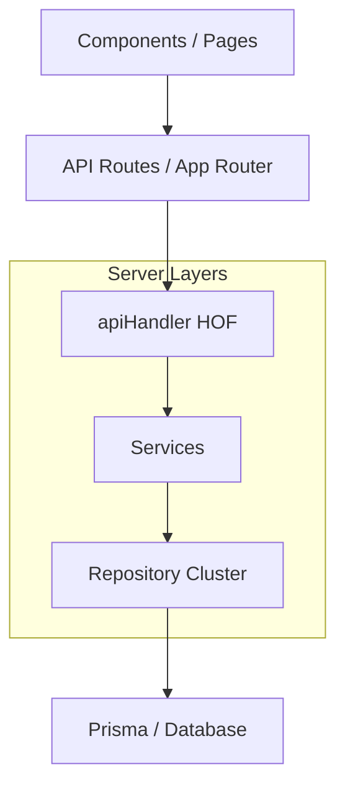
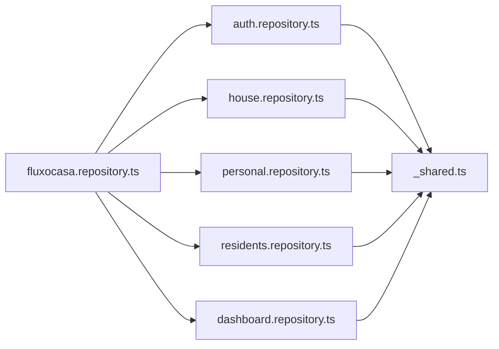

# 🏗️ Architecture: FluxoCasa

Este documento detalha a estrutura técnica do projeto, servindo como guia para manutenção e evolução do sistema.

## 🗺️ Visão Geral

O FluxoCasa segue uma arquitetura de camadas rigorosa para garantir separação de preocupações e facilitar testes automatizados.

## 📚 Camadas Adotadas

### 1. Controllers (API Routes)
Localizadas em `src/app/api`, utilizam o wrapper `apiHandler` para padronizar o comportamento.
- **Responsabilidade**: Orquestrar a entrada, chamar services e retornar respostas HTTP.
- **Padrão**: Não deve conter lógica de negócio, apenas delegação.

### 2. Services (Use Cases)
Localizados em `src/server/services`.
- **Responsabilidade**: Implementar as regras de negócio puras (ex: "quem pode rotacionar convite", "como calcular balanço mensal").
- **Auth**: Quase todos os métodos aceitam um `userId` para garantir isolamento de dados por morador.

### 3. Repository Cluster (Data Access)
Localizados em `src/server/repositories`. Implementado via **Strangler Fig Pattern**.
- **Shared**: Helpers de data e auditoria (`_shared.ts`).
- **Domains**: 5 sub-repositórios divididos por contexto (Auth, House, Personal, Residents, Dashboard).
- **Barrel**: O arquivo `fluxocasa.repository.ts` sincroniza todos os domínios em um único objeto exportado para os services.

## 🛡️ Fluxo de Segurança e Validação

Todas as escritas (POST, PUT, PATCH, DELETE) seguem este pipeline:

1. **Schema Validation**: O `apiHandler` valida o payload via `Zod` antes de chegar ao service.
2. **Data Transformation**: O schema Zod converte dados (ex: Moeda -> Centavos) automaticamente.
3. **Authentication**: O morador é identificado via JWT (Supabase ou Session local).
4. **Authorization**: O Service verifica se o morador pertence à casa ou se possui Role de Admin para a ação.

## 📊 Estrutura de Repositórios

## 🛠️ Guia de Manutenção: Como adicionar um novo recurso

Para manter a consistência, siga sempre esta ordem:

1. **Contracts**: Atualize/Crie interfaces em `src/types/index.ts`.
2. **Validation**: Crie o schema Zod com transformers em `src/server/validation`.
3. **Repository**: Adicione os métodos de banco no repositório de domínio correspondente.
4. **Service**: Implemente a regra de negócio e chame o repositório.
5. **API Route**: Crie a rota usando o `apiHandler`.
6. **UI**: Consuma o endpoint e renderize o componente.

---

*Documentação atualizada em Março de 2026 após refatoração para Arquitetura de Clúster.*
